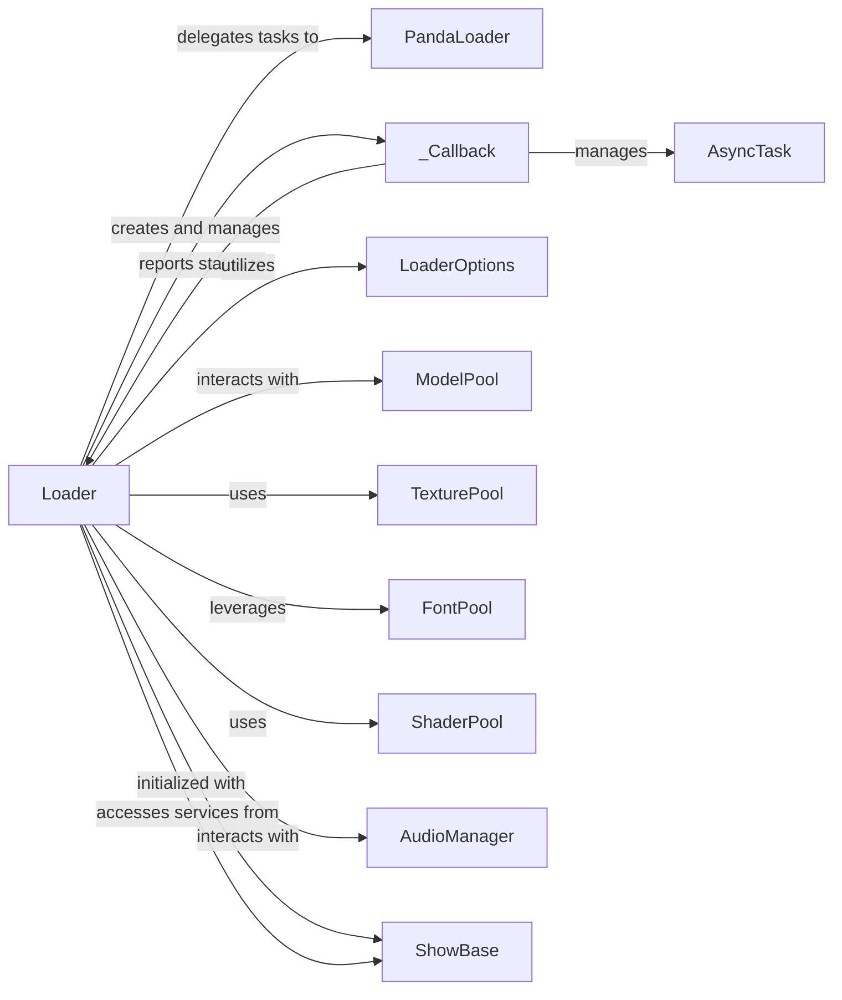

## Component Details

These components are fundamental because they collectively form the backbone of Panda3D's asset loading and management system.

*   **`Loader`** is the primary entry point for developers, providing a high-level, Pythonic interface to load diverse asset types. Its ability to handle both synchronous and asynchronous operations is crucial for maintaining application responsiveness.

*   **`PandaLoader`** is the low-level workhorse, directly interacting with the operating system and Panda3D's core libraries to efficiently read and process files. Without it, the Python `Loader` would be unable to perform its core function.

*   **`_Callback`** is essential for modern game development, enabling non-blocking asset loading. This prevents the application from freezing while large assets are being loaded, leading to a smoother user experience.

*   **`LoaderOptions`** provides fine-grained control over the loading process, allowing developers to optimize performance and memory usage by specifying caching, error handling, and instancing behaviors.

*   **`ModelPool`, `TexturePool`, `FontPool`, and `ShaderPool`** are critical for performance optimization. By caching frequently used assets, they significantly reduce loading times and memory overhead, which is vital in resource-intensive 3D applications.

*   **`AudioManager`** is necessary for handling all sound-related assets, ensuring that audio can be loaded and played back effectively within the game environment.

*   **`AsyncTask`** underpins all asynchronous operations, allowing the engine to perform background tasks without blocking the main thread, which is crucial for maintaining a high frame rate and responsive user interface.

*   **`ShowBase`** acts as the central orchestrator, providing the necessary context and global services (like audio managers and event handling) that the `Loader` needs to function correctly within a Panda3D application.

Together, these components ensure that assets are loaded efficiently, managed effectively, and integrated seamlessly into the Panda3D application, contributing directly to the performance, responsiveness, and overall quality of the virtual world.

### Loader

The `Loader` component is a high-level interface responsible for loading various types of assets, including 3D models, textures, fonts, sounds, and shaders, into the Panda3D runtime. It supports both synchronous and asynchronous loading operations, manages resource caching, and provides mechanisms for error handling. This component is fundamental for populating the virtual world with necessary game assets.

**Related Classes/Methods**:

- `panda3d.core.PandaLoader` (0:0)

- <a href="https://github.com/panda3d/panda3d/blob/master/direct/src/showbase/Loader.py#L0-L0" target="_blank" rel="noopener noreferrer">`direct.src.showbase.Loader._Callback` (0:0)</a>

- `panda3d.core.LoaderOptions` (0:0)

- `panda3d.core.ModelPool` (0:0)

- `panda3d.core.TexturePool` (0:0)

- `panda3d.core.FontPool` (0:0)

- `panda3d.core.ShaderPool` (0:0)

- `panda3d.core.AudioManager` (0:0)

- <a href="https://github.com/panda3d/panda3d/blob/master/direct/src/showbase/ShowBase.py#L0-L0" target="_blank" rel="noopener noreferrer">`direct.src.showbase.ShowBase` (0:0)</a>

### PandaLoader

`PandaLoader` is the core C++ component that performs the actual low-level file loading operations. It is a global pointer accessed by the Python `Loader` class to execute the heavy lifting of reading and processing asset files from disk.

**Related Classes/Methods**: _None_

### _Callback

An inner class within the `Loader` component, `_Callback` acts as a Future-like object for asynchronous loading and saving requests. It allows the application to monitor the status of a background loading operation, cancel it, or await its completion.

**Related Classes/Methods**:

- `panda3d.core.AsyncTask` (0:0)

### LoaderOptions

`LoaderOptions` is a data structure that encapsulates various parameters and flags to control the behavior of asset loading, such as caching preferences, error reporting, and instance handling.

**Related Classes/Methods**: _None_

### ModelPool

`ModelPool` is a caching mechanism specifically for 3D models. It stores loaded models in memory to prevent redundant disk I/O when the same model is requested multiple times.

**Related Classes/Methods**: _None_

### TexturePool

Similar to `ModelPool`, `TexturePool` provides caching for textures. It stores loaded texture data in memory, optimizing performance by avoiding repeated loading from disk.

**Related Classes/Methods**: _None_

### FontPool

`FontPool` is a caching system dedicated to fonts. It manages the loading and storage of font files, which can be either static (egg/bam files) or dynamic (TTF files).

**Related Classes/Methods**: _None_

### ShaderPool

`ShaderPool` is responsible for caching and managing shader programs. Shaders define how objects are rendered and are crucial for visual effects.

**Related Classes/Methods**: _None_

### AudioManager

`AudioManager` is a base class for managing audio playback. Specific implementations (like `sfxManager` for sound effects and `musicManager` for background music) handle the loading and playback of sound files.

**Related Classes/Methods**: _None_

### AsyncTask

`AsyncTask` represents an asynchronous operation that can be executed in a separate thread. In the context of `Loader`, it is used for non-blocking asset loading and model flattening.

**Related Classes/Methods**: _None_

### ShowBase

`ShowBase` is the central application class in Panda3D, providing the main application loop, event management, and access to various global managers and services.

**Related Classes/Methods**: _None_

### [FAQ](https://github.com/CodeBoarding/GeneratedOnBoardings/tree/main?tab=readme-ov-file#faq)