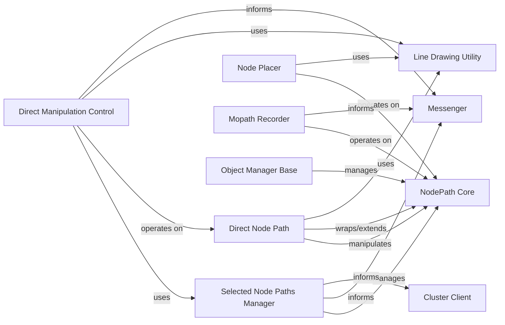

## Component Details

These components are fundamental because they collectively provide the core capabilities for interactive scene editing and manipulation around the NodePath object. They cover: Core Scene Graph Interaction (NodePath Core): The basic building block for all 3D/2D objects. Selection Management (Selected Node Paths Manager): Essential for user interaction and targeting specific objects. Interactive Visual Feedback and Manipulation (Direct Node Path, Line Drawing Utility, Direct Manipulation Control): Crucial for a user-friendly editing experience. Scene Construction and Animation (Node Placer, Mopath Recorder): Key functionalities for building and animating scenes. Centralized Object Management (Object Manager Base): Provides a structured way to handle scene objects. Inter-component Communication (Messenger): Enables a modular and extensible system by allowing components to communicate without direct dependencies. Collaborative Features (Cluster Client): Supports multi-user or distributed editing. Together, these components form a robust system for interacting with and modifying the scene graph, which is the backbone of any 3D application or editor built with Panda3D.

### NodePath Core

This is the fundamental Panda3D class that represents a path to a node in the scene graph. It provides the primary interface for interacting with and manipulating 3D and 2D objects, including transformations (position, rotation, scale), parenting, and rendering properties. Its extensions enhance its capabilities for various direct manipulation and scene editing tasks.

**Related Classes/Methods**:

- <a href="https://github.com/panda3d/panda3d/blob/master/direct/src/extensions_native/NodePath_extensions.py#L1-L1" target="_blank" rel="noopener noreferrer">`NodePath_extensions.py` (1:1)</a>

### Selected Node Paths Manager

This component is responsible for maintaining the state of currently selected and deselected NodePath objects within the interactive environment. It provides mechanisms to add, remove, highlight, and de-highlight selected items, acting as a central registry for user interaction.

**Related Classes/Methods**:

- <a href="https://github.com/panda3d/panda3d/blob/master/contrib/src/sceneeditor/seSelection.py#L1-L1" target="_blank" rel="noopener noreferrer">`seSelection.py` (1:1)</a>

### Direct Node Path

This component extends the basic NodePath with functionalities specifically tailored for direct manipulation and visual feedback within an editing context. It wraps or utilizes a standard Panda3D NodePath and adds capabilities like displaying bounding boxes, highlighting, and retrieving geometric properties, making it the interactive representation of a scene object.

**Related Classes/Methods**:

- <a href="https://github.com/panda3d/panda3d/blob/master/contrib/src/sceneeditor/seGeometry.py#L1-L1" target="_blank" rel="noopener noreferrer">`seGeometry.py` (1:1)</a>

### Line Drawing Utility

This utility class is essential for providing visual feedback during interactive operations in the 3D scene. It is responsible for drawing lines, arrows, and other geometric primitives, which are fundamental for visualizing selections, manipulation axes, grids, and other debugging or informational overlays.

**Related Classes/Methods**:

- <a href="https://github.com/panda3d/panda3d/blob/master/direct/src/directtools/DirectGeometry.py#L1-L1" target="_blank" rel="noopener noreferrer">`DirectGeometry.py` (1:1)</a>

### Node Placer

This component focuses on the precise placement and positioning of NodePath objects within the scene. It handles interactive placement, snapping to grids or other scene elements, and alignment, which are crucial for efficient scene construction and layout.

**Related Classes/Methods**:

- <a href="https://github.com/panda3d/panda3d/blob/master/contrib/src/sceneeditor/sePlacer.py#L1-L1" target="_blank" rel="noopener noreferrer">`sePlacer.py` (1:1)</a>

### Mopath Recorder

This component is dedicated to recording and managing motion paths (Mopaths) associated with NodePath objects. It provides functionality for creating, editing, and applying animations or trajectories to scene elements, which is a common requirement in scene editing and animation workflows.

**Related Classes/Methods**:

- <a href="https://github.com/panda3d/panda3d/blob/master/contrib/src/sceneeditor/seMopathRecorder.py#L1-L1" target="_blank" rel="noopener noreferrer">`seMopathRecorder.py` (1:1)</a>

### Cluster Client

This component facilitates distributed or collaborative editing environments. It handles the synchronization of node selection and deselection, as well as potentially other scene state changes, across multiple clients or instances, ensuring a consistent view of the scene for all participants.

**Related Classes/Methods**:

- <a href="https://github.com/panda3d/panda3d/blob/master/direct/src/cluster/ClusterClient.py#L1-L1" target="_blank" rel="noopener noreferrer">`ClusterClient.py` (1:1)</a>

### Direct Manipulation Control

This is the high-level controller for interactive manipulation (translation, rotation, scaling) of selected NodePath objects. It processes user input (e.g., mouse clicks, drags) and orchestrates the application of corresponding transformations to the NodePath objects, often providing visual feedback through the Line Drawing Utility.

**Related Classes/Methods**:

- <a href="https://github.com/panda3d/panda3d/blob/master/contrib/src/sceneeditor/seManipulation.py#L1-L1" target="_blank" rel="noopener noreferrer">`seManipulation.py` (1:1)</a>

### Object Manager Base

As part of a broader level editor context, this component provides core functionalities for managing objects within a scene. This includes operations like finding, adding, and removing objects by their NodePath, acting as a central registry and interface for scene object management.

**Related Classes/Methods**:

- <a href="https://github.com/panda3d/panda3d/blob/master/direct/src/leveleditor/ObjectMgrBase.py#L1-L1" target="_blank" rel="noopener noreferrer">`ObjectMgrBase.py` (1:1)</a>

### Messenger

This is a fundamental, application-wide messaging system that facilitates decoupled communication between various components. It allows components to broadcast events (e.g., selection changes, manipulation updates) and other components to subscribe to these events, promoting a flexible and extensible architecture.

**Related Classes/Methods**:

- <a href="https://github.com/panda3d/panda3d/blob/master/direct/src/showbase/Messenger.py#L1-L1" target="_blank" rel="noopener noreferrer">`Messenger.py` (1:1)</a>

### [FAQ](https://github.com/CodeBoarding/GeneratedOnBoardings/tree/main?tab=readme-ov-file#faq)