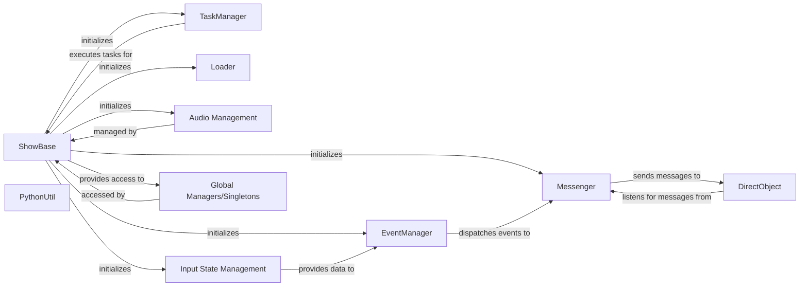

## Component Details

Analysis of fundamental components within the `direct.src.showbase` subsystem of a Panda3D application, their responsibilities, and their interactions.

### ShowBase

The core application class that initializes and manages the entire Panda3D environment. It sets up the rendering system, window management, input handling, audio, and the main task loop. It acts as the central hub, providing access to all other major engine functionalities.

**Related Classes/Methods**:

- <a href="https://github.com/panda3d/panda3d/blob/master/direct/src/showbase/ShowBase.py#L-1-L-1" target="_blank" rel="noopener noreferrer">`ShowBase` (-1:-1)</a>

### TaskManager

Manages and executes various tasks (e.g., rendering, input processing, physics updates, interval animations) in a defined order each frame. It is the scheduler for the application's main loop, ensuring that all time-dependent operations are processed efficiently.

**Related Classes/Methods**:

- `TaskManager` (-1:-1)

### Loader

Responsible for loading external assets such as 3D models (.bam, .egg), textures, and audio files into the Panda3D environment. It provides methods for asynchronous and synchronous loading, managing the asset pipeline.

**Related Classes/Methods**:

- <a href="https://github.com/panda3d/panda3d/blob/master/direct/src/showbase/Loader.py#L-1-L-1" target="_blank" rel="noopener noreferrer">`Loader` (-1:-1)</a>

### Messenger

A global event dispatch system that enables decoupled communication between different parts of the application. Components can send messages (events) without direct knowledge of the receivers, and other components can register to listen for specific messages.

**Related Classes/Methods**:

- <a href="https://github.com/panda3d/panda3d/blob/master/direct/src/showbase/Messenger.py#L-1-L-1" target="_blank" rel="noopener noreferrer">`Messenger` (-1:-1)</a>

### EventManager

Manages the registration and dispatch of events, often tied to user input (keyboard, mouse) or system occurrences. It integrates closely with the `Messenger` to propagate these events throughout the application.

**Related Classes/Methods**:

- <a href="https://github.com/panda3d/panda3d/blob/master/direct/src/showbase/EventManager.py#L-1-L-1" target="_blank" rel="noopener noreferrer">`EventManager` (-1:-1)</a>

### DirectObject

A base class that provides convenient methods for objects to register and unregister themselves with the `Messenger` system. Objects inheriting from `DirectObject` can easily listen for and respond to messages.

**Related Classes/Methods**:

- <a href="https://github.com/panda3d/panda3d/blob/master/direct/src/showbase/DirectObject.py#L-1-L-1" target="_blank" rel="noopener noreferrer">`DirectObject` (-1:-1)</a>

### PythonUtil

A collection of general-purpose Python utility functions and classes used throughout the `ShowBase` and other direct modules. These utilities provide common helpers for various programming tasks within the Panda3D ecosystem.

**Related Classes/Methods**:

- <a href="https://github.com/panda3d/panda3d/blob/master/direct/src/showbase/PythonUtil.py#L-1-L-1" target="_blank" rel="noopener noreferrer">`PythonUtil` (-1:-1)</a>

### Audio Management

Provides functionalities for loading, playing, and controlling sound effects and background music within the application. This includes managing 3D audio spatialization and general sound playback.

**Related Classes/Methods**:

- <a href="https://github.com/panda3d/panda3d/blob/master/direct/src/showbase/Audio3DManager.py#L8-L332" target="_blank" rel="noopener noreferrer">`Audio3DManager` (8:332)</a>

- <a href="https://github.com/panda3d/panda3d/blob/master/direct/src/showbase/SfxPlayer.py#L-1-L-1" target="_blank" rel="noopener noreferrer">`SfxPlayer` (-1:-1)</a>

### Input State Management

Manages the current state of input devices (e.g., mouse, keyboard) and provides a global interface to query their status. It often feeds raw input data into the `EventManager` for higher-level event processing.

**Related Classes/Methods**:

- <a href="https://github.com/panda3d/panda3d/blob/master/direct/src/showbase/InputStateGlobal.py#L-1-L-1" target="_blank" rel="noopener noreferrer">`InputStateGlobal` (-1:-1)</a>

### Global Managers/Singletons

A collection of global instances or singletons that provide convenient, application-wide access to core functionalities. These are often initialized by `ShowBase` and ensure that critical managers are easily accessible from anywhere in the code.

**Related Classes/Methods**:

- <a href="https://github.com/panda3d/panda3d/blob/master/direct/src/showbase/ShowBaseGlobal.py#L-1-L-1" target="_blank" rel="noopener noreferrer">`ShowBaseGlobal` (-1:-1)</a>

- <a href="https://github.com/panda3d/panda3d/blob/master/direct/src/showbase/AppRunnerGlobal.py#L-1-L-1" target="_blank" rel="noopener noreferrer">`AppRunnerGlobal` (-1:-1)</a>

- <a href="https://github.com/panda3d/panda3d/blob/master/direct/src/showbase/BulletinBoardGlobal.py#L-1-L-1" target="_blank" rel="noopener noreferrer">`BulletinBoardGlobal` (-1:-1)</a>

- <a href="https://github.com/panda3d/panda3d/blob/master/direct/src/showbase/PhysicsManagerGlobal.py#L-1-L-1" target="_blank" rel="noopener noreferrer">`PhysicsManagerGlobal` (-1:-1)</a>

### [FAQ](https://github.com/CodeBoarding/GeneratedOnBoardings/tree/main?tab=readme-ov-file#faq)