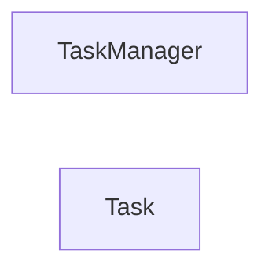

## Component Details

One paragraph explaining the functionality which is represented by this graph. What the main flow is and what is its purpose.

### TaskManager

Manages and executes tasks within the game, handling their lifecycle from creation to completion. It provides methods for adding, removing, and stepping through tasks, and integrates with Panda3D's AsyncTaskManager.

**Related Classes/Methods**:

- <a href="https://github.com/panda3d/panda3d/blob/master/direct/src/task/Task.py#L1-L1" target="_blank" rel="noopener noreferrer">`direct.src.task.Task.TaskManager` (1:1)</a>

### Task

Represents an individual unit of work or action within the game. It is an alias for `panda3d.core.PythonTask`, which is a Python-level wrapper around the C++ `AsyncTask` interface. Tasks can have properties like a name, a callback function, and can be managed by the `TaskManager`.

**Related Classes/Methods**:

- `panda3d.core.PythonTask` (1:1)

### [FAQ](https://github.com/CodeBoarding/GeneratedOnBoardings/tree/main?tab=readme-ov-file#faq)