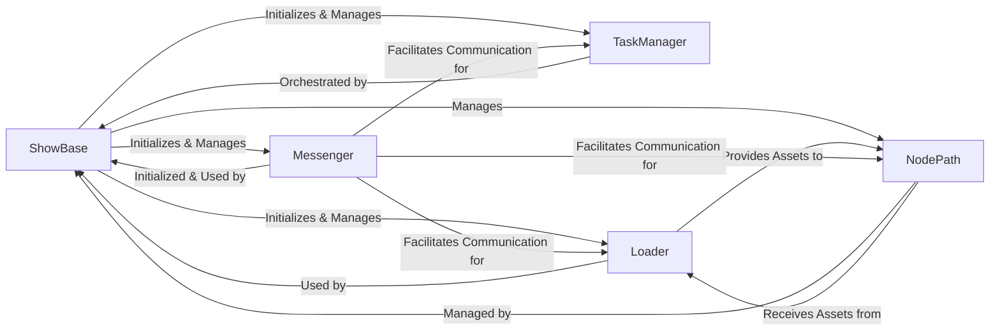

## Component Details

These five components are fundamental because they collectively form the minimal viable core of any interactive 3D application built with Panda3D:

1.  **ShowBase**: It's the application's entry point and the central coordinator. Without it, the engine cannot initialize or run its main loop. It's the "main program" that sets up everything else.

2.  **TaskManager**: Essential for real-time applications, the TaskManager drives the continuous update cycle (the main loop). All dynamic aspects of the scene, from animations to physics to user input processing, rely on tasks scheduled by this manager.

3.  **Loader**: A 3D engine is useless without the ability to bring in external content. The Loader is the dedicated system for importing models, textures, and other media, making it crucial for creating any visual or auditory experience.

4.  **Messenger**: In a complex, event-driven environment like a game engine, Messenger provides a robust and flexible way for different parts of the system to communicate without direct dependencies. This decoupling is vital for maintainability and extensibility.

5.  **NodePath (Scene Graph)**: This represents the actual 3D world structure. All visual objects exist within this hierarchical graph, and NodePath is the primary means by which developers interact with and manipulate these objects. Without the scene graph, there's no organized visual representation to render.

Together, these components handle the application's lifecycle, real-time updates, asset acquisition, inter-system communication, and the fundamental organization of the 3D world, making them the indispensable pillars of the Panda3D architecture.

### ShowBase

The central orchestrator of a Panda3D application. It initializes the core engine systems, sets up the rendering pipeline (3D and 2D scene graphs), manages windows, handles the main application loop, and provides access to global managers. It acts as the primary interface for developers to interact with the engine.

**Related Classes/Methods**:

- <a href="https://github.com/panda3d/panda3d/blob/master/direct/src/showbase/ShowBase.py#L1-L1" target="_blank" rel="noopener noreferrer">`ShowBase` (1:1)</a>

### TaskManager

Manages and schedules Python functions or methods (tasks) to run periodically within the main application loop. It ensures that various engine systems and user-defined logic are updated efficiently each frame, acting as the "heartbeat" of the application.

**Related Classes/Methods**:

- `TaskManager` (1:1)

### Loader

Responsible for loading various types of assets (3D models, textures, sounds, shaders) from disk into the Panda3D runtime. It provides methods to asynchronously load resources and manages a cache, making it indispensable for populating the virtual world.

**Related Classes/Methods**:

- <a href="https://github.com/panda3d/panda3d/blob/master/direct/src/showbase/Loader.py#L1-L1" target="_blank" rel="noopener noreferrer">`Loader` (1:1)</a>

### Messenger

Implements a global event dispatching system. It allows different parts of the application to communicate in a decoupled manner by sending and receiving named events, promoting modularity and extensibility within the engine and user code.

**Related Classes/Methods**:

- <a href="https://github.com/panda3d/panda3d/blob/master/direct/src/showbase/Messenger.py#L1-L1" target="_blank" rel="noopener noreferrer">`Messenger` (1:1)</a>

### NodePath

NodePath is the primary Python interface for interacting with and manipulating the Scene Graph, which is the hierarchical data structure that organizes all 3D and 2D objects within the application. It allows for transformations, parenting, and rendering of visual elements.

**Related Classes/Methods**:

- `NodePath` (1:1)

### [FAQ](https://github.com/CodeBoarding/GeneratedOnBoardings/tree/main?tab=readme-ov-file#faq)